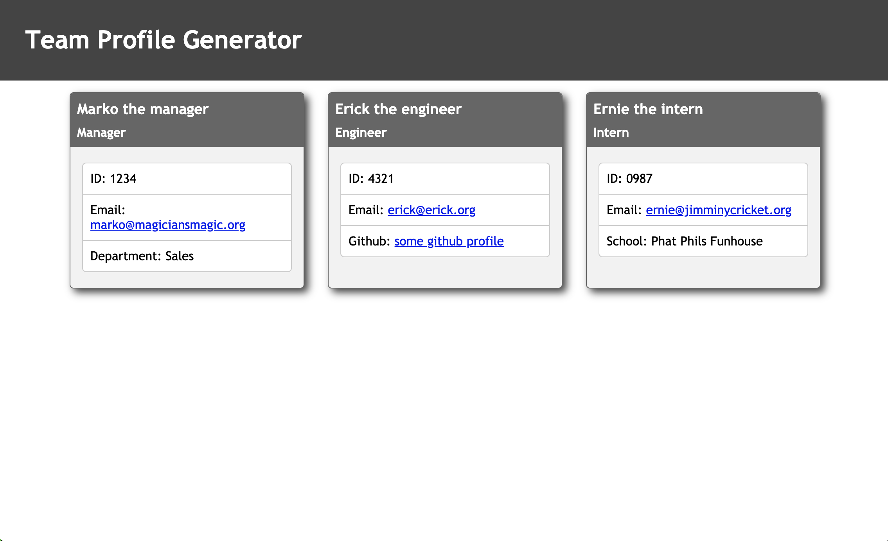

# Profile-Generator (homework 10)

## Description

A Node cli app that will prompt a user for information about the team manager and then information about the team members, then generates an HTML webpage to display summaries of each person. The user can input any number of team members, and they may be a mix of engineers and interns.

## Example of HTML output
https://erickmeline.github.io/Profile-Generator/

## Walkthrough video
https://youtu.be/k80OlSKm_II

## Uses
HTML/CSS/JS/Node

## Librarys
fs/inquirer/jest

## Installation Instructions
npm install

## Usagage Information
node index.js

## Tests
node test

## Screenshot

